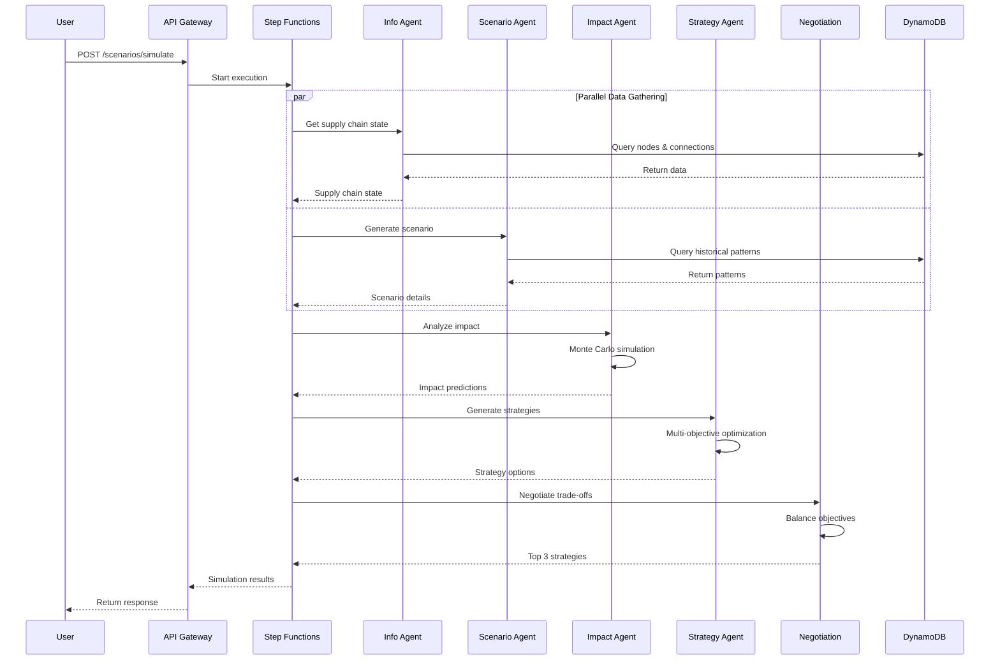
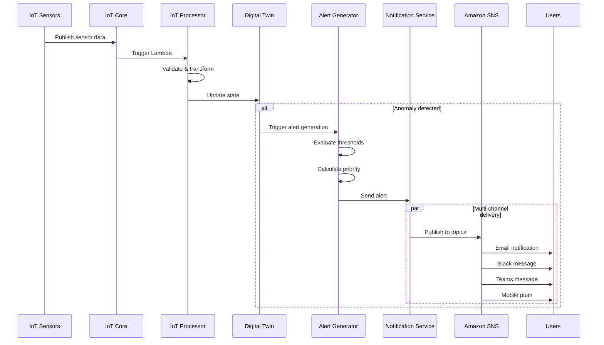
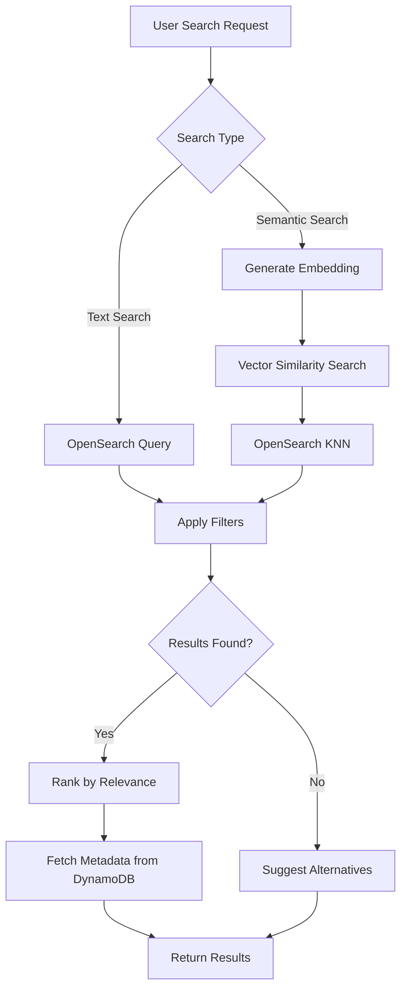
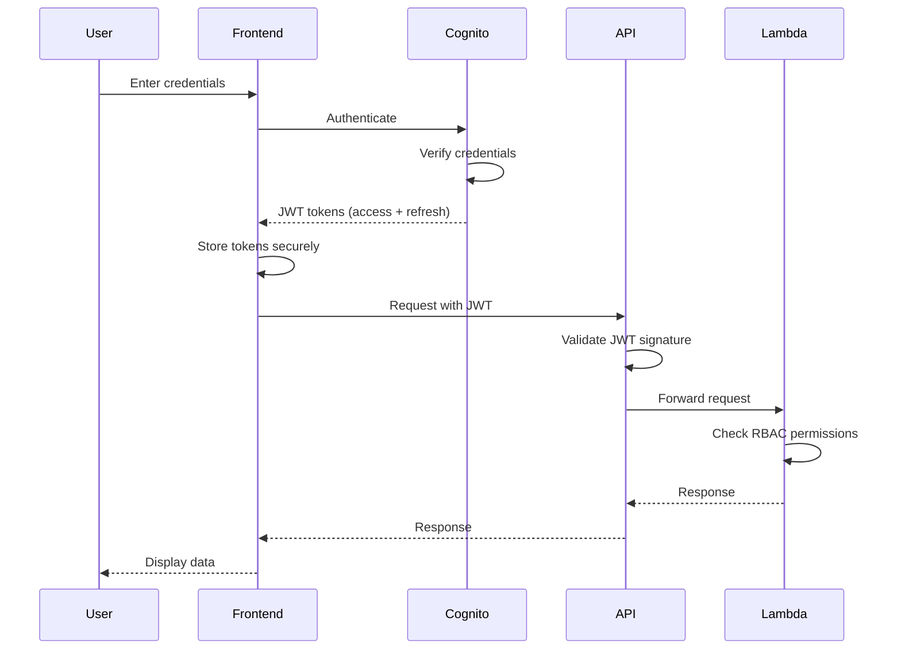

# OmniTrack AI - Architecture Documentation

## Table of Contents
1. [System Overview](#system-overview)
2. [Architecture Layers](#architecture-layers)
3. [Component Diagrams](#component-diagrams)
4. [Data Flow Diagrams](#data-flow-diagrams)
5. [Deployment Architecture](#deployment-architecture)
6. [Security Architecture](#security-architecture)

## System Overview

OmniTrack AI is a cloud-native supply chain resilience platform built on AWS infrastructure. The system employs a serverless, event-driven architecture with multiple specialized AI agents orchestrated through AWS Step Functions.

### Key Architectural Principles

- **Serverless-First**: Leverages AWS Lambda for compute, eliminating server management
- **Event-Driven**: Uses EventBridge, SNS, and WebSockets for real-time communication
- **Microservices**: Loosely coupled services with well-defined interfaces
- **Multi-Agent**: Specialized AI agents collaborate to solve complex problems
- **Scalable**: Auto-scales based on demand with no manual intervention
- **Observable**: Comprehensive logging, metrics, and tracing with CloudWatch and X-Ray

## Architecture Layers

### 1. Presentation Layer

The presentation layer provides multiple interfaces for user interaction:

```
┌─────────────────────────────────────────────────────────────┐
│                    Presentation Layer                       │
│                                                             │
│  ┌──────────────┐  ┌──────────────┐  ┌──────────────┐    │
│  │   Next.js    │  │  Amazon Lex  │  │   WebXR/AR   │    │
│  │   Web App    │  │    Voice     │  │  Visualizer  │    │
│  │              │  │  Interface   │  │              │    │
│  │  - React 19  │  │              │  │  - Three.js  │    │
│  │  - Tailwind  │  │  - NLP       │  │  - WebXR API │    │
│  │  - SWR       │  │  - TTS/STT   │  │              │    │
│  └──────────────┘  └──────────────┘  └──────────────┘    │
└─────────────────────────────────────────────────────────────┘
```

**Components:**
- **Next.js Web Application**: Primary user interface with server-side rendering
- **Amazon Lex Voice Interface**: Natural language voice commands
- **WebXR AR Visualizer**: Immersive 3D supply chain visualization

### 2. API Gateway Layer

```
┌─────────────────────────────────────────────────────────────┐
│                    API Gateway Layer                        │
│                                                             │
│  ┌──────────────────────┐  ┌──────────────────────┐       │
│  │   REST API Gateway   │  │  WebSocket Gateway   │       │
│  │                      │  │                      │       │
│  │  - Authentication    │  │  - Real-time alerts  │       │
│  │  - Rate limiting     │  │  - Live updates      │       │
│  │  - Request validation│  │  - Bi-directional    │       │
│  │  - CORS              │  │    communication     │       │
│  └──────────────────────┘  └──────────────────────┘       │
│                                                             │
│  ┌──────────────────────────────────────────────┐         │
│  │            AWS WAF (Web Application          │         │
│  │               Firewall)                      │         │
│  │  - SQL injection protection                  │         │
│  │  - XSS protection                            │         │
│  │  - Rate-based rules                          │         │
│  └──────────────────────────────────────────────┘         │
└─────────────────────────────────────────────────────────────┘
```

### 3. Application Layer

The application layer contains the core business logic implemented as Lambda functions:

```
┌─────────────────────────────────────────────────────────────┐
│                   Application Layer                         │
│                                                             │
│  ┌────────────────────────────────────────────────────┐   │
│  │      AWS Step Functions Orchestrator               │   │
│  │      (Multi-Agent Coordination)                    │   │
│  │                                                    │   │
│  │  - Parallel agent execution                       │   │
│  │  - Result aggregation                             │   │
│  │  - Error handling & retry                         │   │
│  │  - Negotiation workflow                           │   │
│  └────────────────────────────────────────────────────┘   │
│                                                             │
│  ┌──────────┬──────────┬──────────┬──────────┬─────────┐ │
│  │   Info   │ Scenario │  Impact  │ Strategy │Learning │ │
│  │  Agent   │  Agent   │  Agent   │  Agent   │ Module  │ │
│  │          │          │          │          │         │ │
│  │ Lambda   │ Lambda   │ Lambda   │ Lambda   │ Lambda  │ │
│  └──────────┴──────────┴──────────┴──────────┴─────────┘ │
│                                                             │
│  ┌──────────┬──────────┬──────────┬──────────┬─────────┐ │
│  │   IoT    │  Alert   │Marketplace│Sustain-  │  Voice  │ │
│  │Processor │Generator │ Service  │ability   │ Service │ │
│  │          │          │          │ Service  │         │ │
│  │ Lambda   │ Lambda   │ Lambda   │ Lambda   │ Lambda  │ │
│  └──────────┴──────────┴──────────┴──────────┴─────────┘ │
└─────────────────────────────────────────────────────────────┘
```

### 4. Data Layer

```
┌─────────────────────────────────────────────────────────────┐
│                      Data Layer                             │
│                                                             │
│  ┌──────────────┐  ┌──────────────┐  ┌──────────────┐    │
│  │  DynamoDB    │  │  OpenSearch  │  │ ElastiCache  │    │
│  │              │  │              │  │   (Redis)    │    │
│  │ - Single     │  │ - Vector     │  │              │    │
│  │   table      │  │   embeddings │  │ - Session    │    │
│  │ - GSIs       │  │ - Full-text  │  │   cache      │    │
│  │ - Streams    │  │   search     │  │ - Simulation │    │
│  │              │  │ - Faceted    │  │   cache      │    │
│  │              │  │   filtering  │  │              │    │
│  └──────────────┘  └──────────────┘  └──────────────┘    │
│                                                             │
│  ┌──────────────┐  ┌──────────────┐  ┌──────────────┐    │
│  │      S3      │  │  IoT Core    │  │   Bedrock    │    │
│  │              │  │              │  │              │    │
│  │ - Digital    │  │ - Thing      │  │ - Claude 3   │    │
│  │   twin       │  │   registry   │  │ - Titan      │    │
│  │   snapshots  │  │ - MQTT       │  │   embeddings │    │
│  │ - Model      │  │   topics     │  │ - LLM        │    │
│  │   artifacts  │  │ - Rules      │  │   reasoning  │    │
│  └──────────────┘  └──────────────┘  └──────────────┘    │
└─────────────────────────────────────────────────────────────┘
```

## Component Diagrams

### Multi-Agent Orchestration Flow



### Real-Time Alert Flow



### Marketplace Search Flow



## Data Flow Diagrams

### Scenario Simulation Data Flow

```
┌─────────────┐
│    User     │
└──────┬──────┘
       │ 1. Submit scenario parameters
       ▼
┌─────────────────────┐
│   API Gateway       │
└──────┬──────────────┘
       │ 2. Validate & authenticate
       ▼
┌─────────────────────┐
│  Step Functions     │
└──────┬──────────────┘
       │ 3. Orchestrate agents
       │
       ├─────────────────────────────────┐
       │                                 │
       ▼                                 ▼
┌─────────────┐                   ┌─────────────┐
│ Info Agent  │                   │Scenario Agent│
└──────┬──────┘                   └──────┬───────┘
       │ 4a. Fetch state                 │ 4b. Generate scenario
       ▼                                 ▼
┌─────────────┐                   ┌─────────────┐
│  DynamoDB   │                   │   Bedrock   │
└─────────────┘                   └─────────────┘
       │                                 │
       └────────────┬────────────────────┘
                    │ 5. Combined data
                    ▼
             ┌─────────────┐
             │Impact Agent │
             └──────┬──────┘
                    │ 6. Simulate impacts
                    ▼
             ┌─────────────┐
             │Strategy Agent│
             └──────┬──────┘
                    │ 7. Generate strategies
                    ▼
             ┌─────────────┐
             │ Negotiation │
             └──────┬──────┘
                    │ 8. Balance objectives
                    ▼
             ┌─────────────┐
             │   Results   │
             └──────┬──────┘
                    │ 9. Return to user
                    ▼
             ┌─────────────┐
             │    User     │
             └─────────────┘
```

### Learning Module Data Flow

```
┌─────────────┐
│    User     │
└──────┬──────┘
       │ 1. Submit feedback
       ▼
┌─────────────────────┐
│  Feedback Handler   │
└──────┬──────────────┘
       │ 2. Store feedback
       ▼
┌─────────────────────┐
│    DynamoDB         │
└──────┬──────────────┘
       │ 3. Trigger on threshold
       ▼
┌─────────────────────┐
│ Learning Service    │
└──────┬──────────────┘
       │ 4. Prepare training data
       ▼
┌─────────────────────┐
│   SageMaker         │
└──────┬──────────────┘
       │ 5. Train model
       ▼
┌─────────────────────┐
│   S3 (Artifacts)    │
└──────┬──────────────┘
       │ 6. Deploy model
       ▼
┌─────────────────────┐
│  Scenario Agent     │
└─────────────────────┘
```

## Deployment Architecture

### AWS Region Architecture

```
┌─────────────────────────────────────────────────────────────┐
│                      AWS Region (us-east-1)                 │
│                                                             │
│  ┌───────────────────────────────────────────────────────┐ │
│  │                    VPC (10.0.0.0/16)                  │ │
│  │                                                       │ │
│  │  ┌─────────────────┐  ┌─────────────────┐           │ │
│  │  │  Public Subnet  │  │  Public Subnet  │           │ │
│  │  │   (AZ-1)        │  │   (AZ-2)        │           │ │
│  │  │                 │  │                 │           │ │
│  │  │  - NAT Gateway  │  │  - NAT Gateway  │           │ │
│  │  └─────────────────┘  └─────────────────┘           │ │
│  │                                                       │ │
│  │  ┌─────────────────┐  ┌─────────────────┐           │ │
│  │  │ Private Subnet  │  │ Private Subnet  │           │ │
│  │  │   (AZ-1)        │  │   (AZ-2)        │           │ │
│  │  │                 │  │                 │           │ │
│  │  │  - Lambda       │  │  - Lambda       │           │ │
│  │  │  - ElastiCache  │  │  - ElastiCache  │           │ │
│  │  └─────────────────┘  └─────────────────┘           │ │
│  │                                                       │ │
│  │  ┌─────────────────┐  ┌─────────────────┐           │ │
│  │  │ Private Subnet  │  │ Private Subnet  │           │ │
│  │  │   (AZ-1)        │  │   (AZ-2)        │           │ │
│  │  │                 │  │                 │           │ │
│  │  │  - OpenSearch   │  │  - OpenSearch   │           │ │
│  │  └─────────────────┘  └─────────────────┘           │ │
│  └───────────────────────────────────────────────────────┘ │
│                                                             │
│  ┌───────────────────────────────────────────────────────┐ │
│  │              Managed Services (Regional)              │ │
│  │                                                       │ │
│  │  - DynamoDB (Multi-AZ)                               │ │
│  │  - S3 (Multi-AZ)                                     │ │
│  │  - Cognito                                           │ │
│  │  - API Gateway                                       │ │
│  │  - Step Functions                                    │ │
│  │  - IoT Core                                          │ │
│  │  - Bedrock                                           │ │
│  │  - SageMaker                                         │ │
│  └───────────────────────────────────────────────────────┘ │
└─────────────────────────────────────────────────────────────┘
```

### Multi-Region Deployment (Future)

```
┌──────────────────────┐         ┌──────────────────────┐
│   Primary Region     │         │   Secondary Region   │
│    (us-east-1)       │         │    (eu-west-1)       │
│                      │         │                      │
│  - Active traffic    │◄───────►│  - Standby/Read      │
│  - Read/Write        │  Sync   │  - Read replicas     │
│  - Full services     │         │  - DR ready          │
└──────────────────────┘         └──────────────────────┘
           │                                │
           └────────────┬───────────────────┘
                        │
                        ▼
              ┌──────────────────┐
              │  Route 53        │
              │  (Global DNS)    │
              │                  │
              │  - Health checks │
              │  - Failover      │
              │  - Latency-based │
              └──────────────────┘
```

## Security Architecture

### Defense in Depth

```
┌─────────────────────────────────────────────────────────────┐
│                    Security Layers                          │
│                                                             │
│  Layer 1: Network Security                                 │
│  ┌───────────────────────────────────────────────────────┐ │
│  │  - AWS WAF (SQL injection, XSS protection)           │ │
│  │  - VPC with private subnets                          │ │
│  │  - Security groups (least privilege)                 │ │
│  │  - NACLs (network ACLs)                              │ │
│  └───────────────────────────────────────────────────────┘ │
│                                                             │
│  Layer 2: Identity & Access                                │
│  ┌───────────────────────────────────────────────────────┐ │
│  │  - Amazon Cognito (user authentication)              │ │
│  │  - IAM roles (service authentication)                │ │
│  │  - JWT tokens (API authorization)                    │ │
│  │  - RBAC (role-based access control)                  │ │
│  └───────────────────────────────────────────────────────┘ │
│                                                             │
│  Layer 3: Data Protection                                  │
│  ┌───────────────────────────────────────────────────────┐ │
│  │  - KMS encryption (data at rest)                     │ │
│  │  - TLS 1.3 (data in transit)                         │ │
│  │  - DynamoDB encryption                               │ │
│  │  - S3 bucket encryption                              │ │
│  └───────────────────────────────────────────────────────┘ │
│                                                             │
│  Layer 4: Application Security                             │
│  ┌───────────────────────────────────────────────────────┐ │
│  │  - Input validation                                  │ │
│  │  - Output encoding                                   │ │
│  │  - Rate limiting                                     │ │
│  │  - CORS policies                                     │ │
│  └───────────────────────────────────────────────────────┘ │
│                                                             │
│  Layer 5: Monitoring & Audit                               │
│  ┌───────────────────────────────────────────────────────┐ │
│  │  - CloudWatch Logs (centralized logging)             │ │
│  │  - CloudTrail (API audit trail)                      │ │
│  │  - GuardDuty (threat detection)                      │ │
│  │  - Security Hub (compliance monitoring)              │ │
│  └───────────────────────────────────────────────────────┘ │
└─────────────────────────────────────────────────────────────┘
```

### Authentication Flow



## Scalability Patterns

### Auto-Scaling Strategy

1. **Lambda Concurrency**
   - Reserved concurrency for critical functions
   - Provisioned concurrency for low-latency requirements
   - Automatic scaling based on invocation rate

2. **DynamoDB Capacity**
   - On-demand capacity mode for variable workloads
   - Auto-scaling for predictable patterns
   - Global tables for multi-region access

3. **ElastiCache**
   - Cluster mode enabled for horizontal scaling
   - Read replicas for read-heavy workloads
   - Automatic failover for high availability

4. **API Gateway**
   - Automatic scaling (no configuration needed)
   - Throttling limits per client
   - Usage plans for different tiers

### Performance Optimization

```
┌─────────────────────────────────────────────────────────────┐
│                  Performance Layers                         │
│                                                             │
│  ┌───────────────────────────────────────────────────────┐ │
│  │  CloudFront CDN                                       │ │
│  │  - Static asset caching                              │ │
│  │  - Edge locations worldwide                          │ │
│  │  - Gzip compression                                  │ │
│  └───────────────────────────────────────────────────────┘ │
│                          │                                  │
│                          ▼                                  │
│  ┌───────────────────────────────────────────────────────┐ │
│  │  ElastiCache (Redis)                                 │ │
│  │  - Session caching (TTL: 24h)                        │ │
│  │  - Simulation results (TTL: 1h)                      │ │
│  │  - Digital twin state (TTL: 5m)                      │ │
│  └───────────────────────────────────────────────────────┘ │
│                          │                                  │
│                          ▼                                  │
│  ┌───────────────────────────────────────────────────────┐ │
│  │  Application Layer                                   │ │
│  │  - Lambda optimizations                              │ │
│  │  - Connection pooling                                │ │
│  │  - Batch operations                                  │ │
│  └───────────────────────────────────────────────────────┘ │
│                          │                                  │
│                          ▼                                  │
│  ┌───────────────────────────────────────────────────────┐ │
│  │  Data Layer                                          │ │
│  │  - DynamoDB DAX (microsecond latency)               │ │
│  │  - Optimized indexes                                 │ │
│  │  - Efficient query patterns                          │ │
│  └───────────────────────────────────────────────────────┘ │
└─────────────────────────────────────────────────────────────┘
```

## Disaster Recovery

### Backup Strategy

- **DynamoDB**: Point-in-time recovery (PITR) enabled, continuous backups
- **S3**: Versioning enabled, cross-region replication for critical buckets
- **RTO**: 4 hours (Recovery Time Objective)
- **RPO**: 1 hour (Recovery Point Objective)

### Failover Procedures

1. **Database Failover**: Automatic with DynamoDB global tables
2. **Compute Failover**: Lambda automatically retries in different AZs
3. **DNS Failover**: Route 53 health checks with automatic failover
4. **Manual Failover**: Documented runbook for regional failover

## Monitoring Architecture

```
┌─────────────────────────────────────────────────────────────┐
│                  Observability Stack                        │
│                                                             │
│  ┌───────────────────────────────────────────────────────┐ │
│  │  CloudWatch Logs                                      │ │
│  │  - Centralized log aggregation                        │ │
│  │  - Log insights for querying                          │ │
│  │  - Log retention policies                             │ │
│  └───────────────────────────────────────────────────────┘ │
│                          │                                  │
│                          ▼                                  │
│  ┌───────────────────────────────────────────────────────┐ │
│  │  CloudWatch Metrics                                   │ │
│  │  - Custom business metrics                            │ │
│  │  - Lambda performance metrics                         │ │
│  │  - API Gateway metrics                                │ │
│  └───────────────────────────────────────────────────────┘ │
│                          │                                  │
│                          ▼                                  │
│  ┌───────────────────────────────────────────────────────┐ │
│  │  X-Ray Tracing                                        │ │
│  │  - Distributed tracing                                │ │
│  │  - Service maps                                       │ │
│  │  - Performance bottleneck identification              │ │
│  └───────────────────────────────────────────────────────┘ │
│                          │                                  │
│                          ▼                                  │
│  ┌───────────────────────────────────────────────────────┐ │
│  │  CloudWatch Dashboards                                │ │
│  │  - Real-time system health                            │ │
│  │  - Business KPIs                                      │ │
│  │  - Alert status                                       │ │
│  └───────────────────────────────────────────────────────┘ │
│                          │                                  │
│                          ▼                                  │
│  ┌───────────────────────────────────────────────────────┐ │
│  │  CloudWatch Alarms                                    │ │
│  │  - Threshold-based alerts                             │ │
│  │  - Anomaly detection                                  │ │
│  │  - SNS notifications                                  │ │
│  └───────────────────────────────────────────────────────┘ │
└─────────────────────────────────────────────────────────────┘
```

## Technology Stack Summary

### Frontend
- **Framework**: Next.js 15 with React 19
- **Styling**: TailwindCSS
- **State Management**: React Context + SWR
- **Visualization**: D3.js, Chart.js, Three.js
- **AR**: WebXR API

### Backend
- **Compute**: AWS Lambda (Node.js 20)
- **Orchestration**: AWS Step Functions
- **API**: Amazon API Gateway (REST + WebSocket)
- **Authentication**: Amazon Cognito

### Data
- **Database**: Amazon DynamoDB
- **Search**: Amazon OpenSearch
- **Cache**: Amazon ElastiCache (Redis)
- **Storage**: Amazon S3
- **IoT**: AWS IoT Core

### AI/ML
- **LLM**: Amazon Bedrock (Claude 3, Titan)
- **ML Training**: Amazon SageMaker
- **Voice**: Amazon Lex
- **Embeddings**: Titan Embeddings

### DevOps
- **IaC**: AWS CDK (TypeScript)
- **CI/CD**: GitHub Actions
- **Monitoring**: CloudWatch, X-Ray
- **Security**: WAF, GuardDuty, Security Hub

## References

- [AWS Well-Architected Framework](https://aws.amazon.com/architecture/well-architected/)
- [Serverless Application Lens](https://docs.aws.amazon.com/wellarchitected/latest/serverless-applications-lens/welcome.html)
- [AWS Security Best Practices](https://aws.amazon.com/security/best-practices/)
