# OmniTrack AI - System Flows

## Table of Contents
1. [User Authentication Flow](#user-authentication-flow)
2. [Scenario Simulation Flow](#scenario-simulation-flow)
3. [Alert Generation and Delivery Flow](#alert-generation-and-delivery-flow)
4. [Digital Twin Update Flow](#digital-twin-update-flow)
5. [Marketplace Interaction Flow](#marketplace-interaction-flow)
6. [Learning and Feedback Flow](#learning-and-feedback-flow)
7. [Voice Command Flow](#voice-command-flow)
8. [Cross-Agent Negotiation Flow](#cross-agent-negotiation-flow)

## User Authentication Flow

### Login Flow

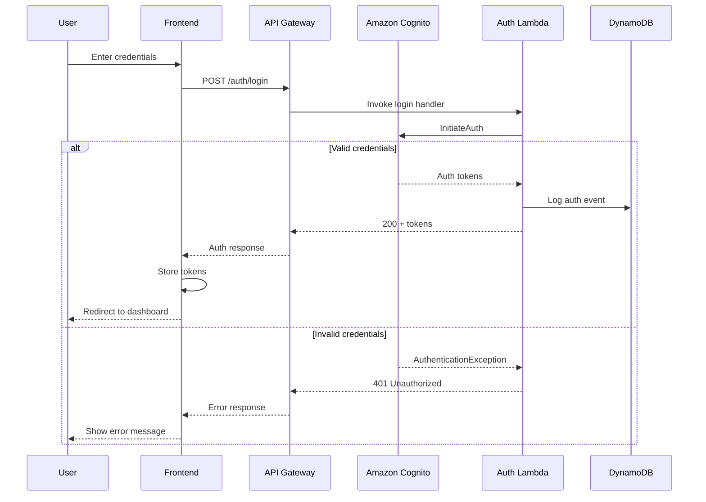
```mermaid
sequenceDiagram
    participant User
    participant Frontend
    participant APIGateway as API Gateway
    participant Cognito as Amazon Cognito
    participant Lambda as Auth Lambda
    participant DynamoDB

    User->>Frontend: Enter credentials
    Frontend->>APIGateway: POST /auth/login
    APIGateway->>Lambda: Invoke login handler
    Lambda->>Cognito: InitiateAuth
    
    alt Valid credentials
        Cognito-->>Lambda: Auth tokens
        Lambda->>DynamoDB: Log auth event
        Lambda-->>APIGateway: 200 + tokens
        APIGateway-->>Frontend: Auth response
        Frontend->>Frontend: Store tokens
        Frontend-->>User: Redirect to dashboard
    else Invalid credentials
        Cognito-->>Lambda: AuthenticationException
        Lambda-->>APIGateway: 401 Unauthorized
        APIGateway-->>Frontend: Error response
        Frontend-->>User: Show error message
    end
```

### Token Refresh Flow

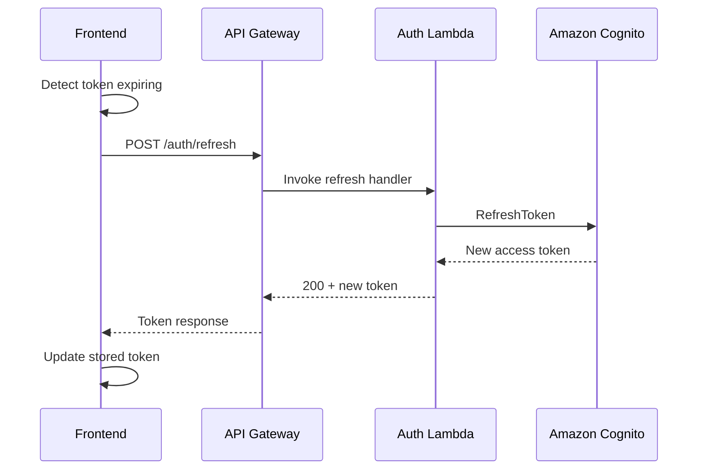
```mermaid
sequenceDiagram
    participant Frontend
    participant APIGateway as API Gateway
    participant Lambda as Auth Lambda
    participant Cognito as Amazon Cognito

    Frontend->>Frontend: Detect token expiring
    Frontend->>APIGateway: POST /auth/refresh
    APIGateway->>Lambda: Invoke refresh handler
    Lambda->>Cognito: RefreshToken
    Cognito-->>Lambda: New access token
    Lambda-->>APIGateway: 200 + new token
    APIGateway-->>Frontend: Token response
    Frontend->>Frontend: Update stored token
```

### Authorization Flow

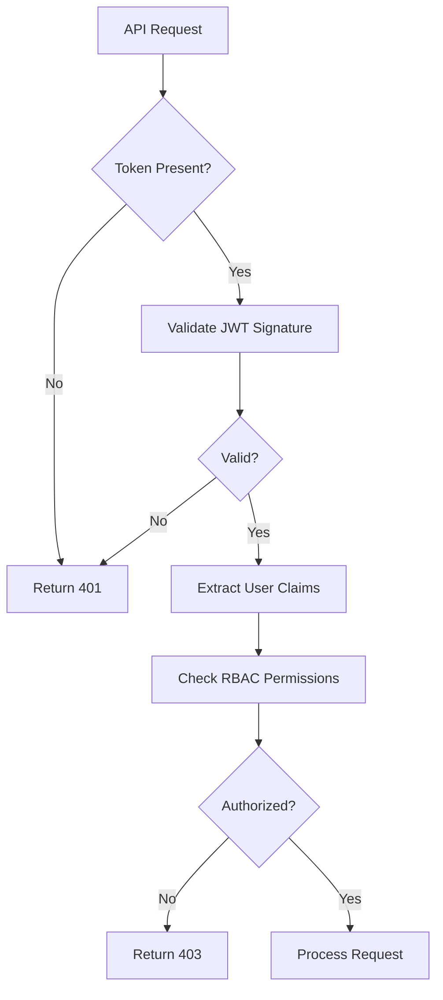
```mermaid
flowchart TD
    A[API Request] --> B{Token Present?}
    B -->|No| C[Return 401]
    B -->|Yes| D[Validate JWT Signature]
    D --> E{Valid?}
    E -->|No| C
    E -->|Yes| F[Extract User Claims]
    F --> G[Check RBAC Permissions]
    G --> H{Authorized?}
    H -->|No| I[Return 403]
    H -->|Yes| J[Process Request]
```

## Scenario Simulation Flow

### Complete Simulation Flow

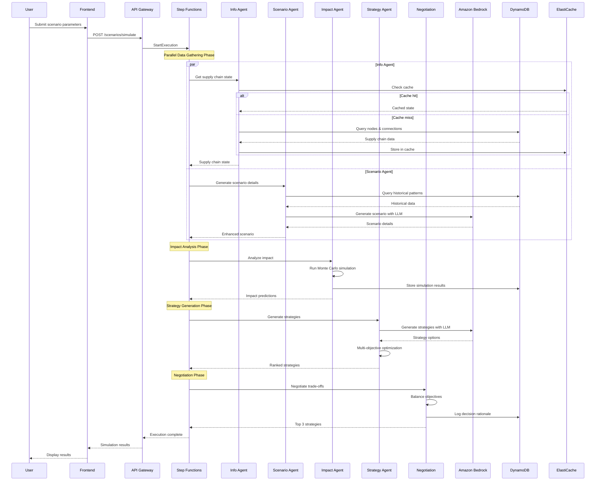
```mermaid
sequenceDiagram
    participant User
    participant Frontend
    participant API as API Gateway
    participant SF as Step Functions
    participant IA as Info Agent
    participant SA as Scenario Agent
    participant ImpA as Impact Agent
    participant StrA as Strategy Agent
    participant Neg as Negotiation
    participant Bedrock as Amazon Bedrock
    participant DB as DynamoDB
    participant Cache as ElastiCache

    User->>Frontend: Submit scenario parameters
    Frontend->>API: POST /scenarios/simulate
    API->>SF: StartExecution
    
    Note over SF: Parallel Data Gathering Phase
    par Info Agent
        SF->>IA: Get supply chain state
        IA->>Cache: Check cache
        alt Cache hit
            Cache-->>IA: Cached state
        else Cache miss
            IA->>DB: Query nodes & connections
            DB-->>IA: Supply chain data
            IA->>Cache: Store in cache
        end
        IA-->>SF: Supply chain state
    and Scenario Agent
        SF->>SA: Generate scenario details
        SA->>DB: Query historical patterns
        DB-->>SA: Historical data
        SA->>Bedrock: Generate scenario with LLM
        Bedrock-->>SA: Scenario details
        SA-->>SF: Enhanced scenario
    end
    
    Note over SF: Impact Analysis Phase
    SF->>ImpA: Analyze impact
    ImpA->>ImpA: Run Monte Carlo simulation
    ImpA->>DB: Store simulation results
    ImpA-->>SF: Impact predictions
    
    Note over SF: Strategy Generation Phase
    SF->>StrA: Generate strategies
    StrA->>Bedrock: Generate strategies with LLM
    Bedrock-->>StrA: Strategy options
    StrA->>StrA: Multi-objective optimization
    StrA-->>SF: Ranked strategies
    
    Note over SF: Negotiation Phase
    SF->>Neg: Negotiate trade-offs
    Neg->>Neg: Balance objectives
    Neg->>DB: Log decision rationale
    Neg-->>SF: Top 3 strategies
    
    SF-->>API: Execution complete
    API-->>Frontend: Simulation results
    Frontend-->>User: Display results
```

### Scenario Variation Generation

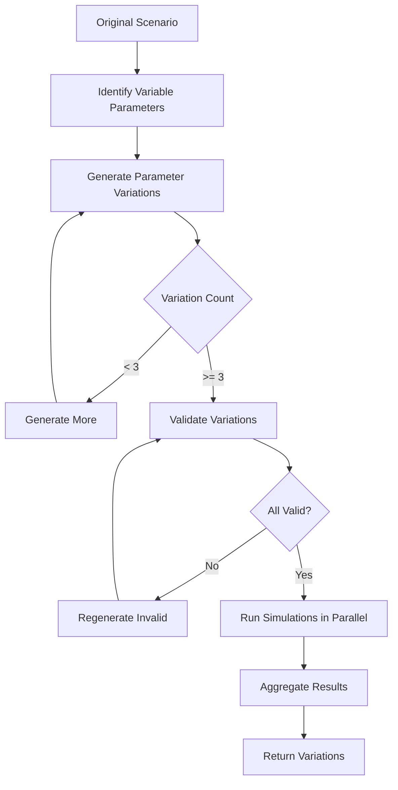
```mermaid
flowchart TD
    A[Original Scenario] --> B[Identify Variable Parameters]
    B --> C[Generate Parameter Variations]
    C --> D{Variation Count}
    D -->|< 3| E[Generate More]
    D -->|>= 3| F[Validate Variations]
    E --> C
    F --> G{All Valid?}
    G -->|No| H[Regenerate Invalid]
    G -->|Yes| I[Run Simulations in Parallel]
    H --> F
    I --> J[Aggregate Results]
    J --> K[Return Variations]
```

## Alert Generation and Delivery Flow

### End-to-End Alert Flow

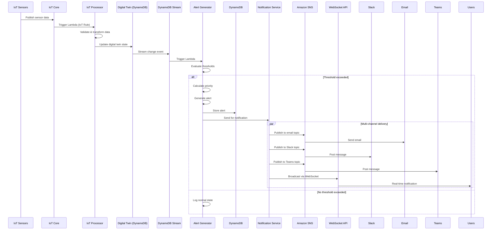
```mermaid
sequenceDiagram
    participant IoT as IoT Sensors
    participant Core as IoT Core
    participant Proc as IoT Processor
    participant DT as Digital Twin (DynamoDB)
    participant Stream as DynamoDB Stream
    participant AG as Alert Generator
    participant DB as DynamoDB
    participant NS as Notification Service
    participant SNS as Amazon SNS
    participant WS as WebSocket API
    participant Slack
    participant Email
    participant Teams
    participant Users

    IoT->>Core: Publish sensor data
    Core->>Proc: Trigger Lambda (IoT Rule)
    Proc->>Proc: Validate & transform data
    Proc->>DT: Update digital twin state
    
    DT->>Stream: Stream change event
    Stream->>AG: Trigger Lambda
    
    AG->>AG: Evaluate thresholds
    alt Threshold exceeded
        AG->>AG: Calculate priority
        AG->>AG: Generate alert
        AG->>DB: Store alert
        AG->>NS: Send for notification
        
        par Multi-channel delivery
            NS->>SNS: Publish to email topic
            SNS->>Email: Send email
            
            NS->>SNS: Publish to Slack topic
            SNS->>Slack: Post message
            
            NS->>SNS: Publish to Teams topic
            SNS->>Teams: Post message
            
            NS->>WS: Broadcast via WebSocket
            WS->>Users: Real-time notification
        end
    else No threshold exceeded
        AG->>AG: Log normal state
    end
```

### Alert Prioritization Logic

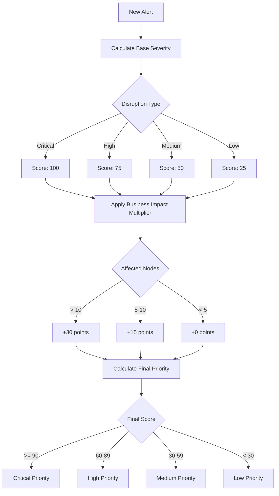
```mermaid
flowchart TD
    A[New Alert] --> B[Calculate Base Severity]
    B --> C{Disruption Type}
    C -->|Critical| D[Score: 100]
    C -->|High| E[Score: 75]
    C -->|Medium| F[Score: 50]
    C -->|Low| G[Score: 25]
    
    D --> H[Apply Business Impact Multiplier]
    E --> H
    F --> H
    G --> H
    
    H --> I{Affected Nodes}
    I -->|> 10| J[+30 points]
    I -->|5-10| K[+15 points]
    I -->|< 5| L[+0 points]
    
    J --> M[Calculate Final Priority]
    K --> M
    L --> M
    
    M --> N{Final Score}
    N -->|>= 90| O[Critical Priority]
    N -->|60-89| P[High Priority]
    N -->|30-59| Q[Medium Priority]
    N -->|< 30| R[Low Priority]
```

## Digital Twin Update Flow

### Real-Time Update Flow

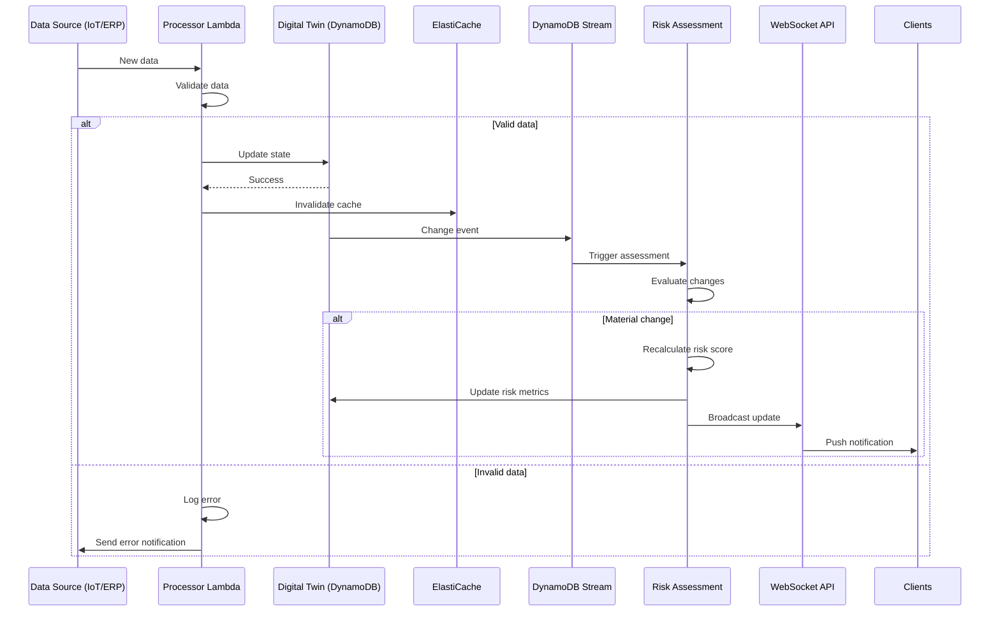
```mermaid
sequenceDiagram
    participant Source as Data Source (IoT/ERP)
    participant Proc as Processor Lambda
    participant DT as Digital Twin (DynamoDB)
    participant Cache as ElastiCache
    participant Stream as DynamoDB Stream
    participant Risk as Risk Assessment
    participant WS as WebSocket API
    participant Clients

    Source->>Proc: New data
    Proc->>Proc: Validate data
    
    alt Valid data
        Proc->>DT: Update state
        DT-->>Proc: Success
        Proc->>Cache: Invalidate cache
        
        DT->>Stream: Change event
        Stream->>Risk: Trigger assessment
        
        Risk->>Risk: Evaluate changes
        alt Material change
            Risk->>Risk: Recalculate risk score
            Risk->>DT: Update risk metrics
            Risk->>WS: Broadcast update
            WS->>Clients: Push notification
        end
    else Invalid data
        Proc->>Proc: Log error
        Proc->>Source: Send error notification
    end
```

### Conflict Resolution Flow

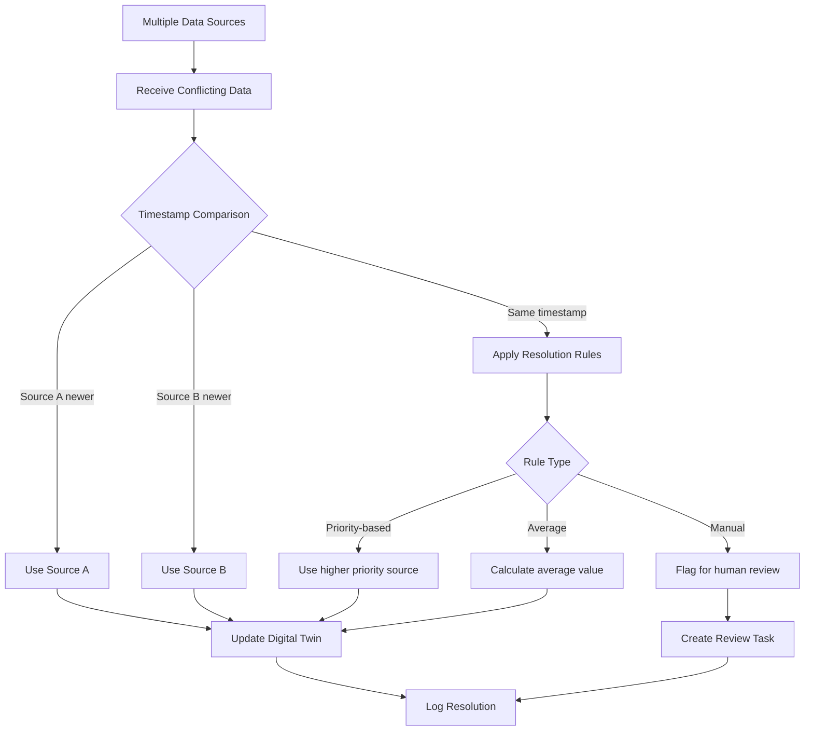
```mermaid
flowchart TD
    A[Multiple Data Sources] --> B[Receive Conflicting Data]
    B --> C{Timestamp Comparison}
    C -->|Source A newer| D[Use Source A]
    C -->|Source B newer| E[Use Source B]
    C -->|Same timestamp| F[Apply Resolution Rules]
    
    F --> G{Rule Type}
    G -->|Priority-based| H[Use higher priority source]
    G -->|Average| I[Calculate average value]
    G -->|Manual| J[Flag for human review]
    
    D --> K[Update Digital Twin]
    E --> K
    H --> K
    I --> K
    J --> L[Create Review Task]
    
    K --> M[Log Resolution]
    L --> M
```

## Marketplace Interaction Flow

### Scenario Publishing Flow

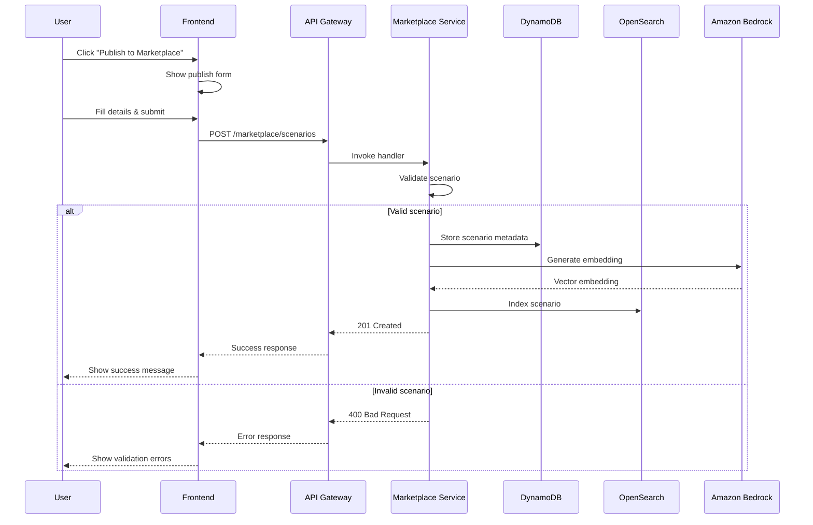
```mermaid
sequenceDiagram
    participant User
    participant Frontend
    participant API as API Gateway
    participant Lambda as Marketplace Service
    participant DB as DynamoDB
    participant OS as OpenSearch
    participant Bedrock as Amazon Bedrock

    User->>Frontend: Click "Publish to Marketplace"
    Frontend->>Frontend: Show publish form
    User->>Frontend: Fill details & submit
    
    Frontend->>API: POST /marketplace/scenarios
    API->>Lambda: Invoke handler
    
    Lambda->>Lambda: Validate scenario
    alt Valid scenario
        Lambda->>DB: Store scenario metadata
        Lambda->>Bedrock: Generate embedding
        Bedrock-->>Lambda: Vector embedding
        Lambda->>OS: Index scenario
        Lambda-->>API: 201 Created
        API-->>Frontend: Success response
        Frontend-->>User: Show success message
    else Invalid scenario
        Lambda-->>API: 400 Bad Request
        API-->>Frontend: Error response
        Frontend-->>User: Show validation errors
    end
```

### Scenario Search Flow

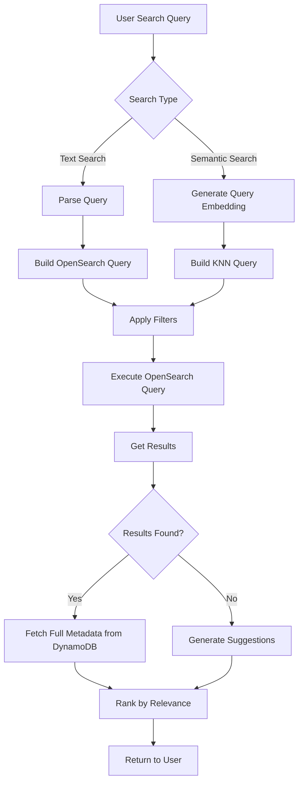
```mermaid
flowchart TD
    A[User Search Query] --> B{Search Type}
    
    B -->|Text Search| C[Parse Query]
    B -->|Semantic Search| D[Generate Query Embedding]
    
    C --> E[Build OpenSearch Query]
    D --> F[Build KNN Query]
    
    E --> G[Apply Filters]
    F --> G
    
    G --> H[Execute OpenSearch Query]
    H --> I[Get Results]
    
    I --> J{Results Found?}
    J -->|Yes| K[Fetch Full Metadata from DynamoDB]
    J -->|No| L[Generate Suggestions]
    
    K --> M[Rank by Relevance]
    L --> M
    
    M --> N[Return to User]
```

### Scenario Forking Flow

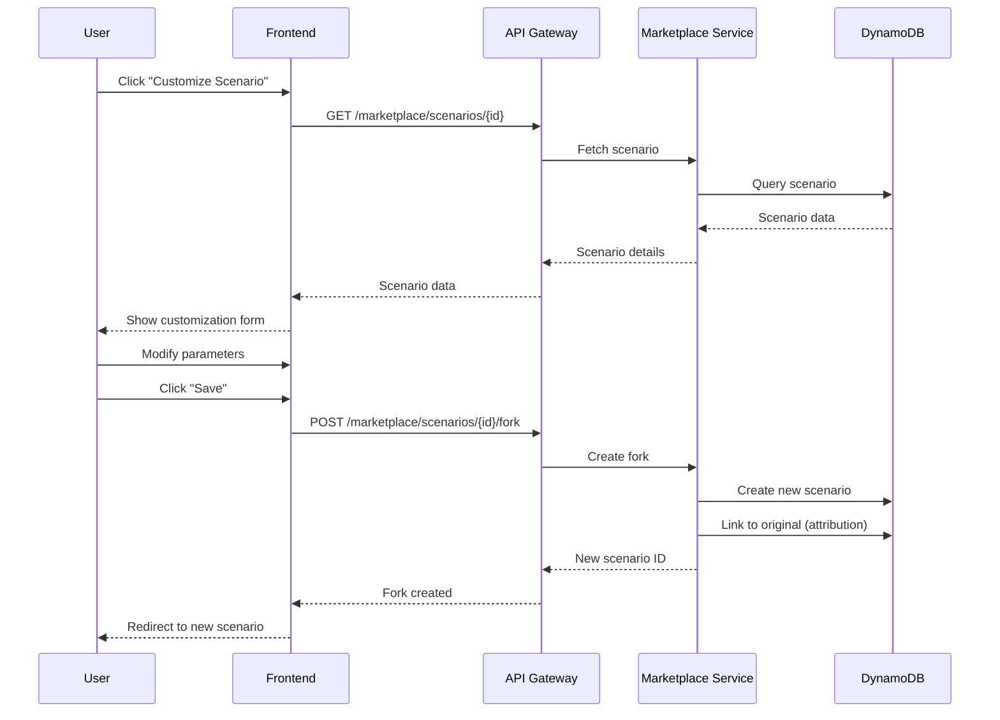
```mermaid
sequenceDiagram
    participant User
    participant Frontend
    participant API as API Gateway
    participant Lambda as Marketplace Service
    participant DB as DynamoDB

    User->>Frontend: Click "Customize Scenario"
    Frontend->>API: GET /marketplace/scenarios/{id}
    API->>Lambda: Fetch scenario
    Lambda->>DB: Query scenario
    DB-->>Lambda: Scenario data
    Lambda-->>API: Scenario details
    API-->>Frontend: Scenario data
    
    Frontend-->>User: Show customization form
    User->>Frontend: Modify parameters
    User->>Frontend: Click "Save"
    
    Frontend->>API: POST /marketplace/scenarios/{id}/fork
    API->>Lambda: Create fork
    Lambda->>DB: Create new scenario
    Lambda->>DB: Link to original (attribution)
    Lambda-->>API: New scenario ID
    API-->>Frontend: Fork created
    Frontend-->>User: Redirect to new scenario
```

## Learning and Feedback Flow

### Feedback Collection Flow

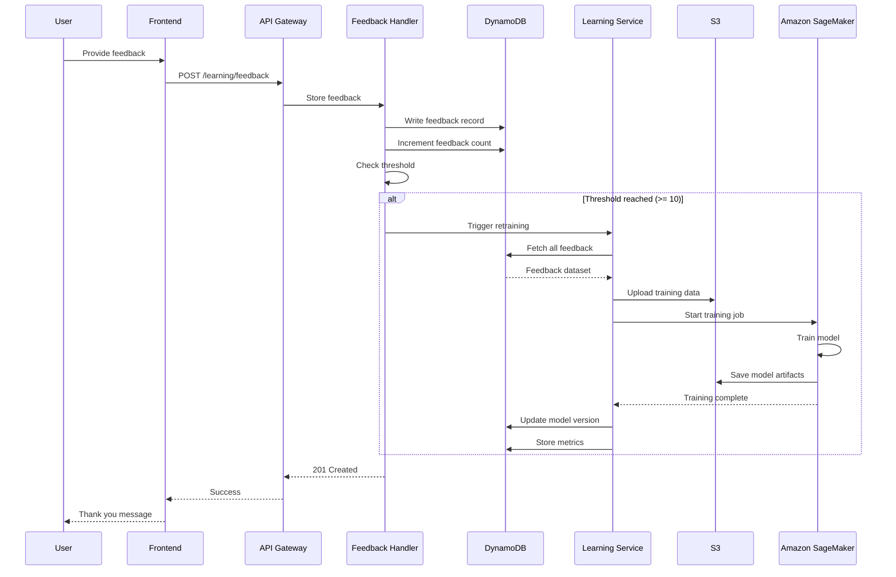
```mermaid
sequenceDiagram
    participant User
    participant Frontend
    participant API as API Gateway
    participant Lambda as Feedback Handler
    participant DB as DynamoDB
    participant Learning as Learning Service
    participant S3
    participant SageMaker as Amazon SageMaker

    User->>Frontend: Provide feedback
    Frontend->>API: POST /learning/feedback
    API->>Lambda: Store feedback
    Lambda->>DB: Write feedback record
    Lambda->>DB: Increment feedback count
    
    Lambda->>Lambda: Check threshold
    alt Threshold reached (>= 10)
        Lambda->>Learning: Trigger retraining
        Learning->>DB: Fetch all feedback
        DB-->>Learning: Feedback dataset
        Learning->>S3: Upload training data
        Learning->>SageMaker: Start training job
        
        SageMaker->>SageMaker: Train model
        SageMaker->>S3: Save model artifacts
        SageMaker-->>Learning: Training complete
        
        Learning->>DB: Update model version
        Learning->>DB: Store metrics
    end
    
    Lambda-->>API: 201 Created
    API-->>Frontend: Success
    Frontend-->>User: Thank you message
```

### Model Update Flow

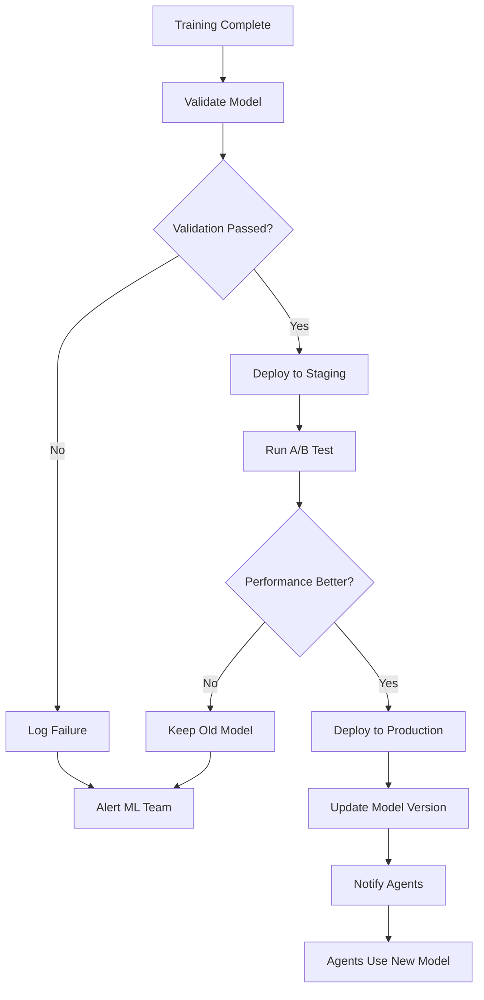
```mermaid
flowchart TD
    A[Training Complete] --> B[Validate Model]
    B --> C{Validation Passed?}
    C -->|No| D[Log Failure]
    C -->|Yes| E[Deploy to Staging]
    
    E --> F[Run A/B Test]
    F --> G{Performance Better?}
    G -->|No| H[Keep Old Model]
    G -->|Yes| I[Deploy to Production]
    
    I --> J[Update Model Version]
    J --> K[Notify Agents]
    K --> L[Agents Use New Model]
    
    D --> M[Alert ML Team]
    H --> M
```

## Voice Command Flow

### Voice Processing Flow

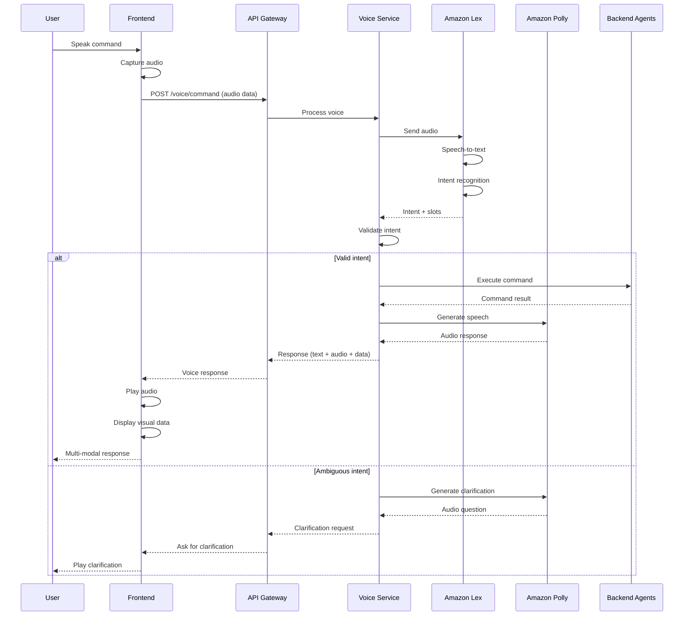
```mermaid
sequenceDiagram
    participant User
    participant Frontend
    participant API as API Gateway
    participant Lambda as Voice Service
    participant Lex as Amazon Lex
    participant Polly as Amazon Polly
    participant Agents as Backend Agents

    User->>Frontend: Speak command
    Frontend->>Frontend: Capture audio
    Frontend->>API: POST /voice/command (audio data)
    API->>Lambda: Process voice
    
    Lambda->>Lex: Send audio
    Lex->>Lex: Speech-to-text
    Lex->>Lex: Intent recognition
    Lex-->>Lambda: Intent + slots
    
    Lambda->>Lambda: Validate intent
    alt Valid intent
        Lambda->>Agents: Execute command
        Agents-->>Lambda: Command result
        
        Lambda->>Polly: Generate speech
        Polly-->>Lambda: Audio response
        
        Lambda-->>API: Response (text + audio + data)
        API-->>Frontend: Voice response
        Frontend->>Frontend: Play audio
        Frontend->>Frontend: Display visual data
        Frontend-->>User: Multi-modal response
    else Ambiguous intent
        Lambda->>Polly: Generate clarification
        Polly-->>Lambda: Audio question
        Lambda-->>API: Clarification request
        API-->>Frontend: Ask for clarification
        Frontend-->>User: Play clarification
    end
```

### Intent Resolution Flow

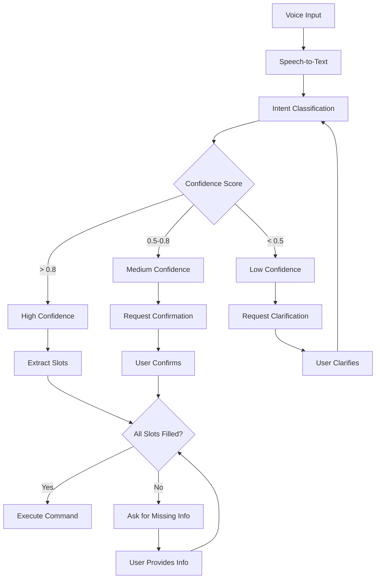
```mermaid
flowchart TD
    A[Voice Input] --> B[Speech-to-Text]
    B --> C[Intent Classification]
    C --> D{Confidence Score}
    
    D -->|> 0.8| E[High Confidence]
    D -->|0.5-0.8| F[Medium Confidence]
    D -->|< 0.5| G[Low Confidence]
    
    E --> H[Extract Slots]
    F --> I[Request Confirmation]
    G --> J[Request Clarification]
    
    H --> K{All Slots Filled?}
    K -->|Yes| L[Execute Command]
    K -->|No| M[Ask for Missing Info]
    
    I --> N[User Confirms]
    N --> K
    
    J --> O[User Clarifies]
    O --> C
    
    M --> P[User Provides Info]
    P --> K
```

## Cross-Agent Negotiation Flow

### Multi-Agent Negotiation Flow

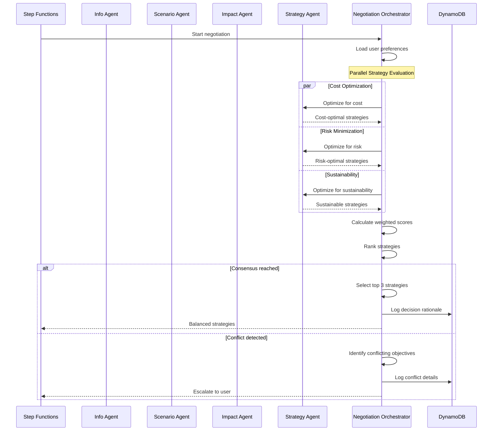
```mermaid
sequenceDiagram
    participant SF as Step Functions
    participant IA as Info Agent
    participant SA as Scenario Agent
    participant ImpA as Impact Agent
    participant StrA as Strategy Agent
    participant Neg as Negotiation Orchestrator
    participant DB as DynamoDB

    SF->>Neg: Start negotiation
    Neg->>Neg: Load user preferences
    
    Note over Neg: Parallel Strategy Evaluation
    par Cost Optimization
        Neg->>StrA: Optimize for cost
        StrA-->>Neg: Cost-optimal strategies
    and Risk Minimization
        Neg->>StrA: Optimize for risk
        StrA-->>Neg: Risk-optimal strategies
    and Sustainability
        Neg->>StrA: Optimize for sustainability
        StrA-->>Neg: Sustainable strategies
    end
    
    Neg->>Neg: Calculate weighted scores
    Neg->>Neg: Rank strategies
    
    alt Consensus reached
        Neg->>Neg: Select top 3 strategies
        Neg->>DB: Log decision rationale
        Neg-->>SF: Balanced strategies
    else Conflict detected
        Neg->>Neg: Identify conflicting objectives
        Neg->>DB: Log conflict details
        Neg-->>SF: Escalate to user
    end
```

### Trade-off Analysis Flow

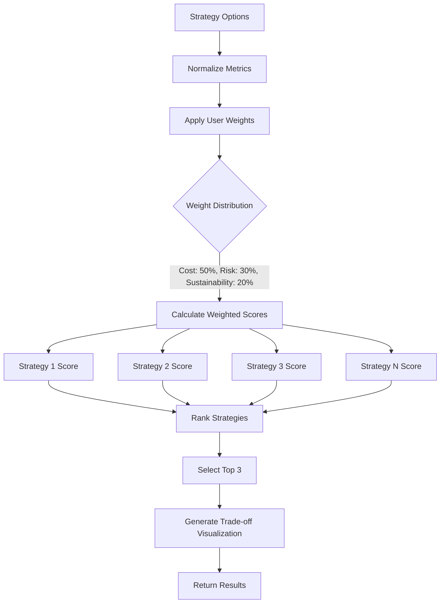
```mermaid
flowchart TD
    A[Strategy Options] --> B[Normalize Metrics]
    B --> C[Apply User Weights]
    
    C --> D{Weight Distribution}
    D -->|Cost: 50%, Risk: 30%, Sustainability: 20%| E[Calculate Weighted Scores]
    
    E --> F[Strategy 1 Score]
    E --> G[Strategy 2 Score]
    E --> H[Strategy 3 Score]
    E --> I[Strategy N Score]
    
    F --> J[Rank Strategies]
    G --> J
    H --> J
    I --> J
    
    J --> K[Select Top 3]
    K --> L[Generate Trade-off Visualization]
    L --> M[Return Results]
```

### Conflict Escalation Flow

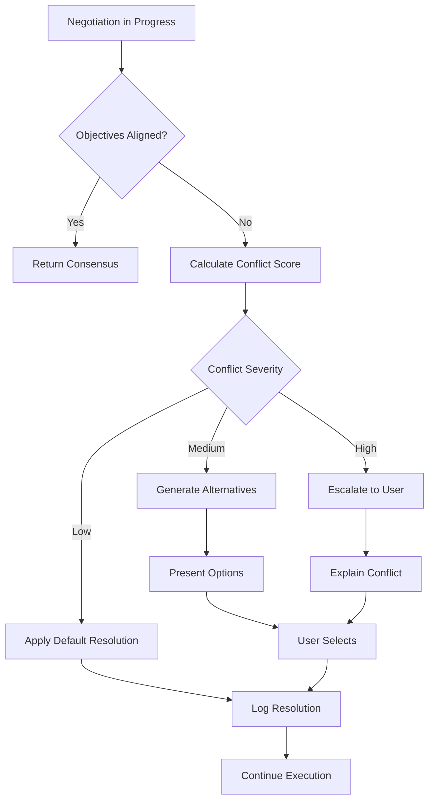
```mermaid
flowchart TD
    A[Negotiation in Progress] --> B{Objectives Aligned?}
    B -->|Yes| C[Return Consensus]
    B -->|No| D[Calculate Conflict Score]
    
    D --> E{Conflict Severity}
    E -->|Low| F[Apply Default Resolution]
    E -->|Medium| G[Generate Alternatives]
    E -->|High| H[Escalate to User]
    
    F --> I[Log Resolution]
    G --> J[Present Options]
    H --> K[Explain Conflict]
    
    J --> L[User Selects]
    K --> L
    
    L --> I
    I --> M[Continue Execution]
```

## Performance Optimization Flows

### Caching Strategy Flow

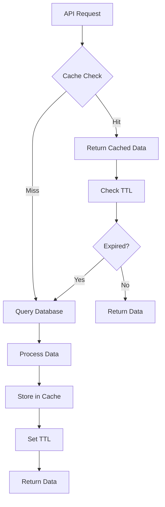
```mermaid
flowchart TD
    A[API Request] --> B{Cache Check}
    B -->|Hit| C[Return Cached Data]
    B -->|Miss| D[Query Database]
    
    D --> E[Process Data]
    E --> F[Store in Cache]
    F --> G[Set TTL]
    G --> H[Return Data]
    
    C --> I[Check TTL]
    I --> J{Expired?}
    J -->|Yes| D
    J -->|No| K[Return Data]
```

### Rate Limiting Flow

```mermaid
flowchart TD
    A[API Request] --> B[Extract Client ID]
    B --> C[Check Rate Limit]
    C --> D{Limit Exceeded?}
    
    D -->|No| E[Increment Counter]
    D -->|Yes| F[Return 429 Too Many Requests]
    
    E --> G[Process Request]
    G --> H[Return Response]
    
    F --> I[Add Retry-After Header]
```

---

**Document Version**: 1.0.0  
**Last Updated**: January 2024  
**For**: OmniTrack AI Platform v1.0
